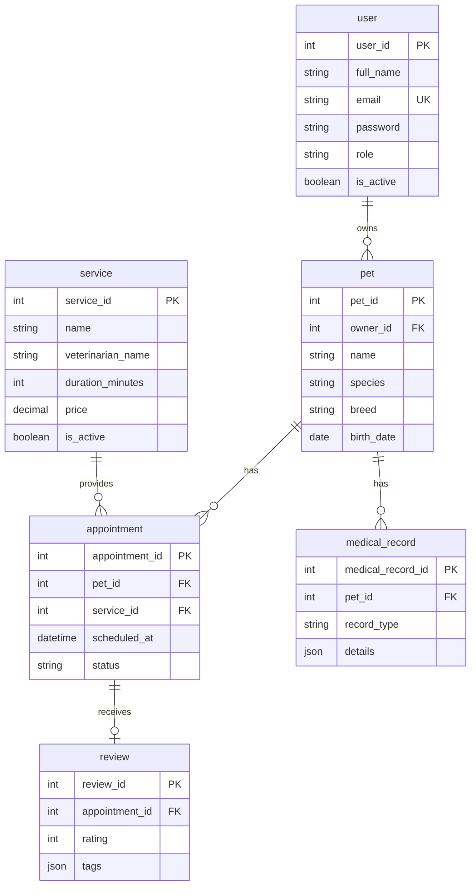

# Diagrama entidad-relación — VetCare v2

```mermaid
erDiagram
    user ||--o{ pet : owns
    pet ||--o{ appointment : has
    service ||--o{ appointment : provides
    appointment ||--o| review : receives
    pet ||--o{ medical_record : has
    user {
        int user_id PK
        string full_name
        string email UK
        string password
        string role
        boolean is_active
    }
    pet {
        int pet_id PK
        int owner_id FK
        string name
        string species
        string breed
        date birth_date
    }
    service {
        int service_id PK
        string name
        string veterinarian_name
        int duration_minutes
        decimal price
        boolean is_active
    }
    appointment {
        int appointment_id PK
        int pet_id FK
        int service_id FK
        datetime scheduled_at
        string status
    }
    review {
        int review_id PK
        int appointment_id FK
        int rating
        json tags
    }
    medical_record {
        int medical_record_id PK
        int pet_id FK
        string record_type
        json details
    }
```
